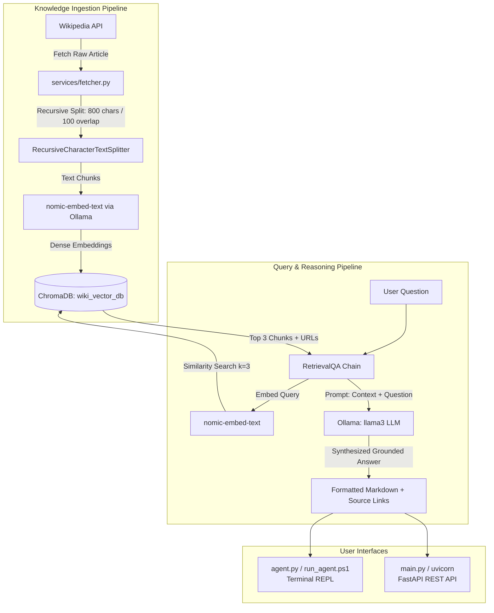

# RAG-Local-Retrieval-Augmented-Generation
A 100% local, private Wikipedia RAG Chatbot &amp; interactive Terminal Agent powered by Ollama (LLaMA 3), LangChain, ChromaDB, and FastAPI. Real-time topic indexing, verifiable citations, and zero cloud API costs. If need any help contact me in profile have linkedin profile link.

# 🧠 WikiAgent: Local Wikipedia RAG Chatbot & Terminal Agent

A 100% private, local, Wikipedia-grounded conversational agent powered by **Ollama**, **LangChain**, **ChromaDB**, and **Wikipedia-API**. Supports both an interactive **Rich Terminal CLI Agent** and a production-ready **FastAPI REST API**. If need any help contact me in profile have linkedin profile link.

---

## 📌 What Type of Agent Is This?

This project is a **Local Retrieval-Augmented Generation (RAG) Knowledge Agent**.

### 1. Classification & Paradigm
* **Agent Type:** **Grounded RAG Knowledge Assistant**
* **Inference Model:** **Local Large Language Model (LLM)** via Ollama (`llama3` 8B or `llama3.2` 3B)
* **Embedding Model:** **Dense Semantic Embedder** (`nomic-embed-text` - 768 dimensions)
* **Vector Store:** **ChromaDB** (Persistent SQLite + HNSW vector indexing)
* **External Knowledge Base:** **Wikimedia API** (dynamic live retrieval of real Wikipedia articles)

### 2. Why RAG?
Standard LLMs suffer from knowledge cutoffs and hallucinations. This agent eliminates both:
1. **Dynamic Real-Time Knowledge:** Pulls current Wikipedia articles on demand using `/add <topic>`.
2. **Strict Grounding:** The LLM is supplied with actual Wikipedia chunks as context and instructed to answer based on those excerpts.
3. **Citations & Transparency:** Every answer includes exact Wikipedia article names, chunk previews, and clickable URLs.
4. **100% Privacy & Offline-Ready:** Once articles are embedded, all embeddings and LLM inferences run completely on your local machine without third-party API keys or cloud telemetry.

---

## 🏗️ System Architecture & Workflow



---

## 📂 Project Structure

```
wiki_chatbot_api/
├── agent.py              # Interactive Terminal CLI Agent with Rich formatting
├── run_agent.ps1         # One-command PowerShell quick launcher
├── run_agent.bat         # One-click Windows CMD / Explorer launcher
├── main.py               # FastAPI application with CORS and route handlers
├── config.py             # Global configurations (Ollama, Chroma, Chunking, Models)
├── requirements.txt      # Locked dependency manifest
├── README.md             # Complete documentation and user guide
├── wiki_vector_db/       # Persistent local ChromaDB database (SQLite + embeddings)
├── models/
│   ├── __init__.py
│   └── schemas.py        # Pydantic schemas for requests and responses
├── services/
│   ├── __init__.py
│   ├── fetcher.py        # Wikipedia fetcher with compliant User-Agent policy
│   ├── embedder.py       # Chunking, embeddings, and ChromaDB vector store
│   └── qa_engine.py      # LangChain RetrievalQA chain and Ollama LLM integration
└── routers/
    ├── __init__.py
    ├── chat.py           # Endpoints: POST /chat/, POST /chat/stream
    ├── topics.py         # Endpoints: /topics/build, /add, /list, /refresh, /search
    └── status.py         # Endpoints: GET /status/, GET /status/health
```

---

## 🚀 Prerequisites

1. **Python 3.9+** (Tested on Python 3.13)
2. **Ollama for Windows** installed.
3. Download the required models in a terminal:
   ```powershell
   ollama pull nomic-embed-text
   ollama pull llama3
   ```
   *(For faster responses on CPU-only machines, you can pull `llama3.2` and set `LLM_MODEL = "llama3.2"` in `config.py`).*

---

## ⚙️ Installation

Navigate to the project folder and set up the virtual environment:

```powershell
# 1. Navigate to project directory
cd C:\Users\91999\.gemini\antigravity\scratch\wiki_chatbot_api

# 2. Create virtual environment
python -m venv .venv

# 3. Install dependencies
.\.venv\Scripts\pip.exe install -r requirements.txt
```

---

## 🖥️ Mode 1: Run the Interactive Terminal Agent (Recommended)

The terminal agent runs directly in your terminal without requiring a web server or browser.

### Launching:
```powershell
.\run_agent.ps1
```
*(Or run `.\.venv\Scripts\python.exe agent.py`, or double-click `run_agent.bat`)*

### Interactive Commands:

| Command | Description | Example |
| :--- | :--- | :--- |
| **`your question`** | Ask any question against indexed Wikipedia knowledge | `What is Python and what are its core features?` |
| **`/add <topic>`** | Fetch and index an article immediately on the fly | `/add Quantum computing` |
| **`/topics`** | List all currently indexed Wikipedia articles | `/topics` |
| **`/search <query>`** | Search Wikipedia for article titles without indexing | `/search Artificial neural network` |
| **`/build`** | Fetch and index all default Wikipedia articles | `/build` |
| **`/stats`** | View vector store count and Ollama connectivity | `/stats` |
| **`/clear`** | Clear the terminal screen | `/clear` |
| **`/help`** | Display the command reference table | `/help` |
| **`exit` / `quit`** | Exit the agent | `exit` |

---

## 🌐 Mode 2: Run as a FastAPI REST API

If you want to integrate the chatbot with web frontends, mobile apps, or automation workflows:

### Launching the Server:
```powershell
.\.venv\Scripts\python.exe -m uvicorn main:app --reload --port 8000
```

### Accessing Interactive Documentation:
* **Swagger UI:** [http://localhost:8000/docs](http://localhost:8000/docs)
* **ReDoc:** [http://localhost:8000/redoc](http://localhost:8000/redoc)

### REST API Endpoints:

| Category | Method | Path | Description |
| :--- | :--- | :--- | :--- |
| **Chat** | `POST` | `/chat/` | Query the chatbot; returns answer and Wikipedia sources. |
| **Chat** | `POST` | `/chat/stream` | Stream answers live using Server-Sent Events (SSE). |
| **Topics** | `POST` | `/topics/build` | Background task: index all 8 default Wikipedia topics. |
| **Topics** | `POST` | `/topics/add` | Background task: index a custom list of Wikipedia topics. |
| **Topics** | `GET` | `/topics/list` | List all currently indexed topics and chunk counts. |
| **Topics** | `POST` | `/topics/refresh` | Re-index or refresh topics. |
| **Topics** | `POST` | `/topics/search` | Search Wikipedia for potential topic titles. |
| **Status** | `GET` | `/status/` | Diagnostics: Ollama connection, loaded models, chunk count. |
| **Status** | `GET` | `/status/health` | Simple liveness health check probe. |

---

## 🛠️ Configuration Guide (`config.py`)

All core parameters can be modified in [config.py](file:///C:/Users/91999/.gemini/antigravity/scratch/wiki_chatbot_api/config.py):

```python
class Config:
    OLLAMA_BASE_URL = "http://localhost:11434" # Ollama server address
    EMBED_MODEL = "nomic-embed-text"            # Embedding model for vector store
    LLM_MODEL = "llama3"                        # LLM model for generation (or llama3.2)
    PERSIST_DIR = Path("./wiki_vector_db")      # Local directory for ChromaDB
    COLLECTION_NAME = "wiki_collection"         # Persistent Chroma collection name
    CHUNK_SIZE = 800                            # Maximum characters per text chunk
    CHUNK_OVERLAP = 100                         # Overlapping characters between chunks
    TOP_K_RESULTS = 3                           # Number of chunks passed to LLM context
    LLM_TEMPERATURE = 0.3                       # Generation temperature (lower = more deterministic)
    LLM_TOP_P = 0.9                             # Nucleus sampling probability
    LLM_REPEAT_PENALTY = 1.1                    # Repetition penalty
```

---

## 🔍 Troubleshooting & Optimization

* **Windows UTF-8 Encoding:** All CLI scripts use UTF-8 (`chcp 65001` and `sys.stdout.reconfigure(encoding="utf-8")`) to prevent `UnicodeEncodeError` on Windows terminals.
* **Database File Locking:** Native ChromaDB `delete_collection()` is used instead of filesystem deletion (`shutil.rmtree`) to prevent `PermissionError: [WinError 32]` on Windows.
* **CPU Inference Optimization:** If responses on CPU take longer than desired, switch to `llama3.2` (3B parameters) by running `ollama pull llama3.2` and updating `LLM_MODEL = "llama3.2"` in `config.py`.
